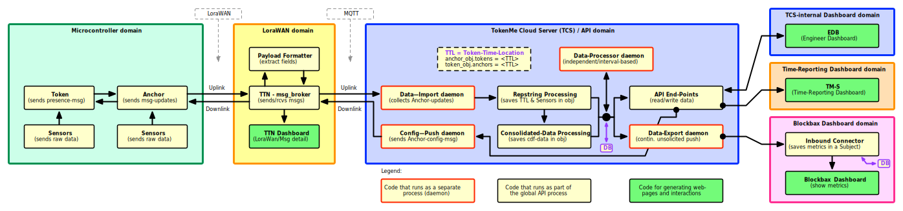
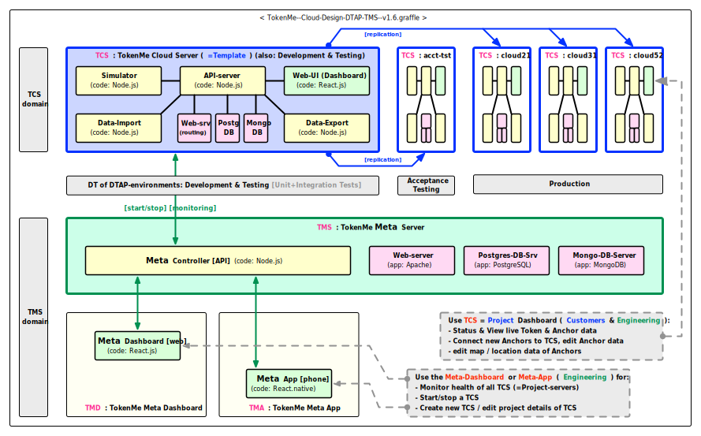

# TCS System Design

The TokenMe system continuously generates TTL (Token:Time:Location) data or records, and stores these records in a central database, and exposes this data in several formats on the API-server.

For every TokenMe project there is a seperate TokenMe Cloud Server or TCS which has its own seperate database.

## TokenMe Component Design

Diagram of the TokenMe Component Design:

<!--   
View image in separate window: <a href="./img/Sostark-TokenMe-dataflow-v1.0.svg" target="_blank">Sostark-TokenMe-dataflow-v1.0.svg</a> -->

<!-- TokenMe--API-v3-Data-Processing--v1.5.svg -->

  
View image in separate window: <a href="./img/TokenMe--API-v3-Data-Processing--v1.5.svg" target="_blank">TokenMe--API-v3-Data-Processing--v1.5.svg</a>

## TokenMe Deployment Design

Diagram of the TokenMe Deployment Design:

<!-- TokenMe--Cloud-Design-DTAP-TMS--v1.6.svg -->

  
View image in separate window: <a href="./img/TokenMe--Cloud-Design-DTAP-TMS--v1.6.svg" target="_blank">TokenMe--Cloud-Design-DTAP-TMS--v1.6.svg</a>

<!-- ## Anchor Data Upload

TokenMe support 3 methods for an Anchor to upload/publish its TTL (Token-Time-Location) data:

1. REST-API/HTTP-POST
2. LoraWAN-publish
3. MQTT-publish (not yet implemented)

### Anchor-upload via HTTP-POST

https://cloud52.sostark.nl/code/75114096/dashboard/api/reports -->

## TCS Demo Server

For the purpose of reference and integration testing, TokenMe has set-up a seperate TCS

- API (base-address): https://demo.tcs.sostark.nl/api/
- API (ping): https://demo.tcs.sostark.nl/api/sys-ping
- Web (Dashboard): https://demo.tcs.sostark.nl/web/
