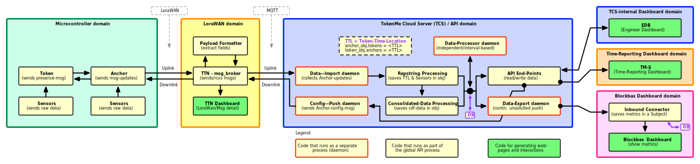

# TokenMe Design

## Token-Time-Location &ndash; TTL

The TokenMe system continuously generates `TTL` for "Token:Time:Location" data or records, and stores these records in a central database, and exposes this data in several formats on the API-server.

The TTL data originates at the `Anchor`, which is a small box (approx. 10 x 10 x 10 cm) with a microcontroller inside and sensors and antennas, that is mounted on a fixed location on a floor of a building. This Anchor continuously looks (radio-based) for Tokens.

`Tokens` are "wearables" (approx 2 x 2 x 0.5 cm) and also contain a microcontroller and sensors and a antenna, but now designed to be very energy-efficient, and they send out signals or beacons, which are to be seen or received by one or more Anchors.

Anchors next send a `Report` to a central server, called TokenMe Cloud Server or `TCS`, at some interval (typically 1-4 seconds on WiFi, and 6-20 seconds on LoraWan). This report is actually a byte-string, or affectionality called a "hex-string", which has all data encoded therein: the Anchor-ID, a list of Token-ID's that are recently seen, and a list of sensor data. This string is internally called a "Repstring" (short for Report-string).

The central TCS cloud server receives this Anchor update message (repstring) and decodes the repstring, and saves the fresh data in 2 formats (and also in 2 seperate databases):

- `iTTL` or Instantaneous TTL:   this is the actual, unmodified TTL data, and this is saved in 2 DB-tables (in Postgres-DB): `tbl_anchordata` and `tbl_tokendata`
- `cTTL` or Consolidated TTL:   this is processed TTL data, whichs gives an overview of the TTL data of the last 30-seconds (variable called `max_age`), and this is stored in 2 tables/collections (in MongoDB): `Anchors` and `Tokens`

Note that the TCS cloud server stores all TTL data in 2 "views":

- the `Anchor-view`: shows from the Anchor perspective, what Tokens it has seen, and for each Token: at what time.
- the `Token-view`: shows from the Token perspective, what ANchors it was seen by, and for each Anchor: at what time.

## TokenMe Cloud Server &ndash; TCS

For every TokenMe project there is a seperate `TokenMe Cloud Server` or `TCS` which has its own seperate database.

Diagram of the TokenMe Component Design:

  
(view image in separate window: <a href="./img/TokenMe--API-v3-Data-Processing--v1.5.svg" target="_blank">TokenMe--API-v3-Data-Processing--v1.5.svg</a>)

## TokenMe Deployment Design

The TokenMe potentially runs hundreds or thoussands of seperate TCS servers, one for each project. To be able to reliably and also flexibly run these TCS-instances, TokenMe has designed a deployment system, with an orchestration tool that all manages this: the TokenMe Meta System or `TMS`.

Next to the flexible replication and deployemnt of TCS servers, this deployment design also keeps a `DTAP` environment (seperate systems or environments for: Development, Testing, Acceptance-testing, and Production).

Diagram of the TokenMe Deployment Design:

  
(view image in separate window: <a href="./img/TokenMe--Cloud-Design-DTAP-TMS--v1.6.svg" target="_blank">TokenMe--Cloud-Design-DTAP-TMS--v1.6.svg</a>)

Note that internally each TCS has a unique number or identifier: `TCS-ID`, which at the moment is a 2-digit decimal number, but will later grow to be 3-digit. We have reserved these "special-purpose" TCS-ID's:

- `tcs-90`: this is the `demo-TCS` that is used for this API-specification, to be able to read and inspect "real live-data" when calling an API Endpoint.
- `tcs-91`: this is the internal development TCS system, which we use to further develop, or debug/troubleshoot some issues, and then do an "internal acceptance test" (the A from DTAP) to verify before releasing a new production version.

## TCS Demo Server

As mentioned above, we have set-up a special TCS server, and continuously populate it with live TTL-data, in order for our customers and partners or resellers, who want to use this API, to see the actual data-structures, that is exposed by the API Endpoints.

This demo-TCS server has the internal TCS-ID `tcs-90`, and is reachable at these URL or hostnames (both names use the same HTTP-server):

- https://demo.tcs.sostark.nl/
- https://prd.tcs90.sostark.nl/

This `Demo-TCS` provides both an API, and a Web-UI or Dashboard (all TCS servers provide this):

- API (base-address): https://demo.tcs.sostark.nl/api/
- API (ping/test): https://demo.tcs.sostark.nl/api/sys-ping
- Web-UI (Dashboard): https://demo.tcs.sostark.nl/web/

<!--
<table>
<tr>
<th>Purpose</th><th>URL Web-address</th>
</tr>
<tr>
<td>API (base-address)</td><td>https://demo.tcs.sostark.nl/api/</td>
</tr>
<tr>
<td>API (ping/test)</td><td>https://demo.tcs.sostark.nl/api/sys-ping</td>
</tr>
<tr>
<td>Web-UI (Dashboard)</td><td>https://demo.tcs.sostark.nl/web/</td>
</tr>
</table>
 -->
