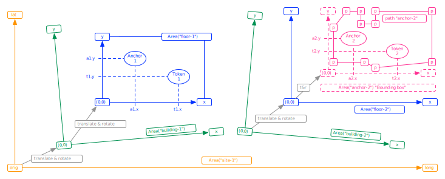

# Area Specification

The before mentioned locations of Tokens at a certain time (a [position fix](https://en.wikipedia.org/wiki/Geopositioning#Background)), need to be defined in some coordinate system, and with some metrics:

- In some scenarios it is preferred to use "local metrics, so a {x,y,z} 3D-coordinate in meters or centimers is practical, which is the [Cartesian coordinate system](https://en.wikipedia.org/wiki/Cartesian_coordinate_system),
- But in other scenarios one could prefer to use "global metrics, so then we need the [Geographic coordinate system](https://en.wikipedia.org/wiki/Geographic_coordinate_system) using {latitude,longitude,altitude} (where lat,long is in [Decimal Degrees](https://en.wikipedia.org/wiki/Decimal_degrees), and alt is in meters or centimeters).

## Automatic calculations

For these calculation we have defined a separate endpoint:

<span class="mono">https://cloud.sostark.nl/wtc-nd-test/api/areas</span>

Which is using this internal data structure:

```js
{
  "response": "404: resource not found.",
  "meta": {
    "server_name": "wtc-nd-test",
    "environment": "test",
    "api_version": "2.0.0",
    "query_method_path": "GET /api/areas?last=3",
    "endpoint": "/api/areas",
    "server_time": 1641187243,
    "query_count": 1,
    "status_code": 404
  }
}
```

Note that the definition of Areas is **hierarchical**, meaning that a Site-area can contain several Building-areas, and each Building can contain several Floor-areas, and each Floor several Anchor-areas.

This hierarchy is depicted in this diagram:

 <br>
View image in separate window: <a href="./img/Sostark-TokenMe-API-design-v1.0.svg" target="_blank">Sostark-TokenMe-API-design-v1.0.svg</a>

