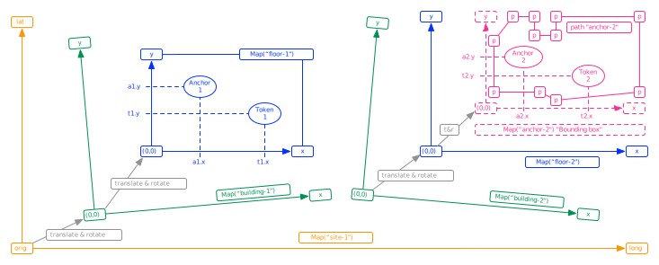

# Map Specification

The before mentioned locations of Tokens at a certain time (a [position fix](https://en.wikipedia.org/wiki/Geopositioning#Background)), need to be defined in some coordinate system, and with some metrics:

- In some scenarios it is preferred to use "local metrics, so a {x,y,z} 3D-coordinate in meters or centimers is practical, which is the [Cartesian coordinate system](https://en.wikipedia.org/wiki/Cartesian_coordinate_system),
- But in other scenarios one could prefer to use "global metrics, so then we need the [Geographic coordinate system](https://en.wikipedia.org/wiki/Geographic_coordinate_system) using {latitude,longitude,altitude} (where lat,long is in [Decimal Degrees](https://en.wikipedia.org/wiki/Decimal_degrees), and alt is in meters or centimeters).

## Automatic calculations

For these calculation we have defined a separate endpoint:

<span class="mono">https://cloud.sostark.nl/wtc-nd-test/api/maps</span>

Which is using this internal data structure:

```js
{
  "maps": [
    {
      "map_id": "Floor-1",
      "description": "Map of Floor-1 containing 3 maps",
      "child_maps": [
        "Map-A91",
        "Map-A92",
        "Map-A93",
        "Map-A94",
        "Map-A95",
        "Map-A96"
      ],
      "origin": {
        "x": 0,
        "y": 0,
      },
      "rotate": 0,
      "size": {
        "width": 60,
        "height": 30,
      },
      "path": [],
      "label_pos": "mid-mid",
    },
    {
      "map_id": "Map-A91",
      "description": "Map of anchor-91",
      "parent_map": "Floor-1",
      "child_maps": [],
      "origin": {
        "x": 0,
        "y": 15,
      },
      "rotate": 0,
      "size": {
        "width": 20,
        "height": 15,
      },
      "path": [],
      "label_pos": "left-top",
    },
    {
      "map_id": "Map-A92",
      "description": "Map of anchor-92",
      "parent_map": "Floor-1",
      "child_maps": [],
      "origin": {
        "x": 20,
        "y": 15,
      },
      "rotate": 0,
      "size": {
        "width": 20,
        "height": 15,
      },
      "path": [],
      "label_pos": "mid-top",
    }
  ],
  "meta": {
    "server_name": "wtc-nd-test",
    "environment": "test",
    "api_version": "2.0.0",
    "query_method_path": "GET /api/maps?last=3",
    "endpoint": "/api/maps",
    "server_time": 1641232457,
    "query_count": 1,
    "status_code": 200
  }
}
```

Note that the definition of Maps is **hierarchical**, meaning that a Site-map can contain several Building-maps, and each Building can contain several Floor-maps, and each Floor several Anchor-maps.

This hierarchy is depicted in this diagram:

 <br>
View image in separate window: <a href="./img/TokenMe-API-design-v1.1.svg" target="_blank">TokenMe-API-design-v1.1.svg</a>

